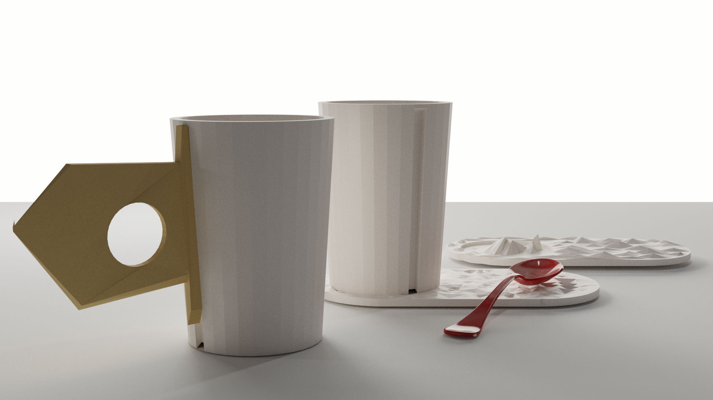
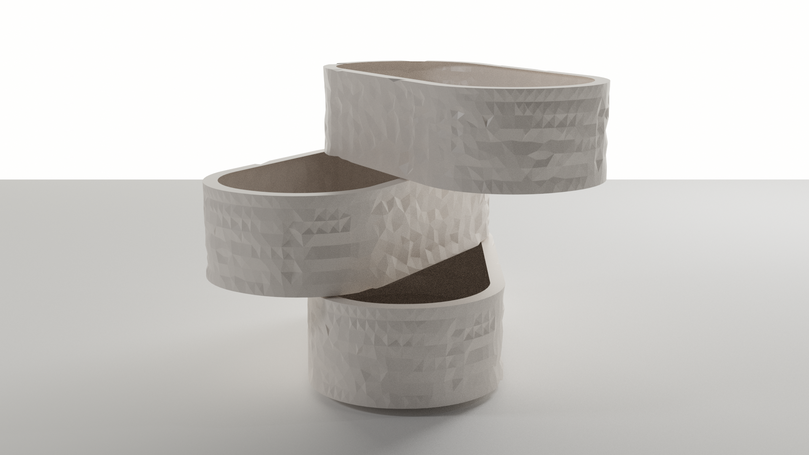
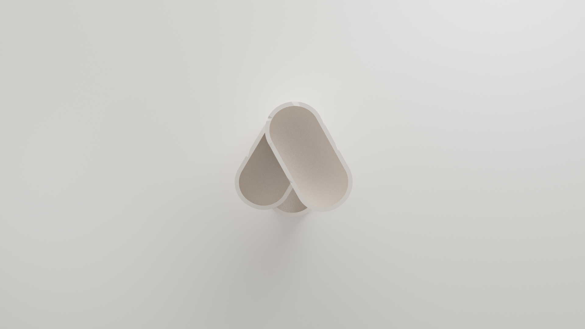
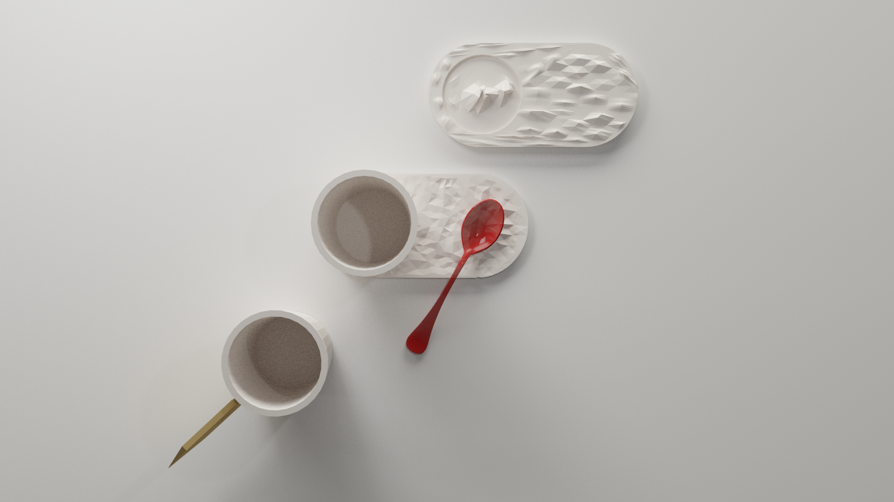
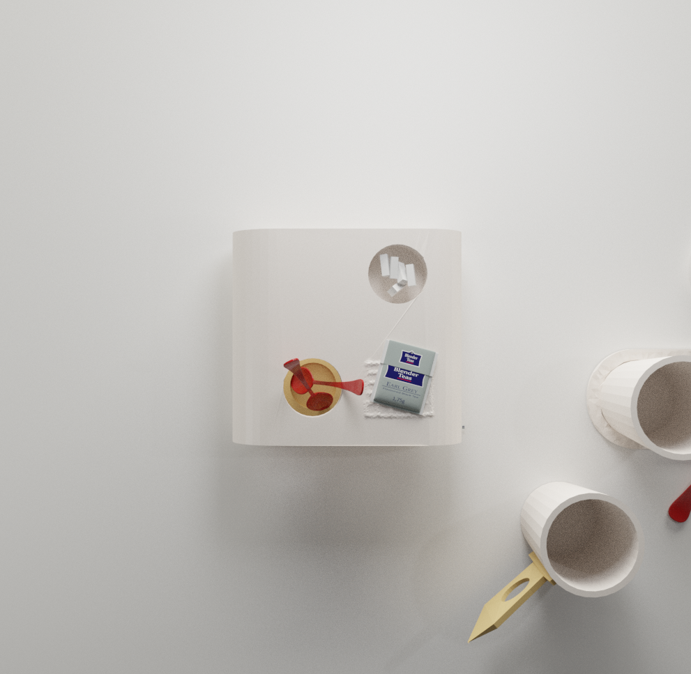

# Workshop

Un service de table pour le café associatif de la Tracterie à l'issu du workshop en partenariat avec le collectif Ne Rougissez pas!

## Les missions

1. Conception d'un contenant d'un litre minimum, destiné à contenir et servir des boissons (froides, chaudes), pouvant évantuellement être détournées pour accueillir des fleurs coupées, préparer des boissons...

2. Conception de contenants « tasse à café » (entre 10 et 15 cl) et « tasse à thé, café allongé, infusions » (entre 30 et 40cl) pouvant éventuellement être détournés pour accueillir des boissons froides.

3. Conception d'un dispositif de présentation des élements annexes: touillettes, sucres, sachets de thé, petits gâteaux,... Comment contenir, ordonner et valoriser des éléments épars ?

## Les techniques

### Tournage
La technique la plus perfectionnée est celle du tournage. Elle nécessite cependant un apprentissage prolongé. Cette technique a fait son apparition aux alentours de 4000 ans av. J.-C., révolutionnant la poterie en permettant d'obtenir rapidement des formes beaucoup plus régulières et des pièces beaucoup plus légères.

Le tour se compose d'un plateau rotatif appelé **girelle**. Après avoir disposé une motte d'argile au centre du plateau, le potier centre sa terre puis la façonne pendant sa rotation.

Lorsque la pièce tournée a pris la consistance « cuir », le tourneur rectifie les imperfections et creuse le pied de la poterie ; il s'agit du tournassage. Cette opération est suivie, le cas échéant par l'« ansage » (pose des anses) et la gravure de la pièce selon le modèle choisi.

Le tournage ne permet d'obtenir que des pièces de révolution, qui peuvent cependant être déformées avant séchage complet.

### Montage à la plaque
Des plaques de terre sont réalisées à l'aide d'un rouleau puis assemblées à la barbotine.
Cette technique est rapide, mais ne permet de faire que des pièces géométriques. On peut cependant obtenir des formes cylindriques en roulant la plaque et en assemblant les deux extrémités opposées.

### Modelage et pinch pot
Technique la plus primitive, le modelage est la mise en forme d'une boule de terre par la pression des doigts.

## Les couleurs

<ul style="color: white; display: flex; text-align: center;margin-bottom: 30px; justify-content: center;flex-wrap:wrap;">
<li style="background-color: #d83f43; flex-grow: 1;padding: 1em; margin-right: 1em;    border-radius: 1em;">Rouge brique</li>
<li style="background-color: #6d90ec; flex-grow: 1;padding: 1em; margin-right: 1em;    border-radius: 1em;">Bleu lavande</li>
<li style="background-color: #6cedc8; flex-grow: 1;padding: 1em;     border-radius: 1em;">Vert d'eau</li>
</ul>

## Les axes de conception

Concevoir des objets:

1. Du quotidien (robustes, ergonomiques, ...)
2. Hybrides (multifonctions, à détourner, ...)
3. Peu encombrants (compacts, empilables, ...)
4. Intégrant des matériaux du collectif ou leur empreinte

## Phase 1. Le workshop
## Phase 2. La recherche
## Phase 3. Développement et Prototypage

### Blender

J'ai utilisé [Blender](https://builder.blender.org/download) pour modéliser les pièces pour le dispositif de La Tracterie et en profiter pour apprendre l'outil de modélisation, animation et rendu 3D.

### Tutoriaux Blender

- Création d'un plan incurvé [Voir la vidéo](https://www.youtube.com/watch?v=clH9BftgrQE)
- Création de trou dans un objet à partir d'un autre objet [Voir la vidéo](https://www.youtube.com/watch?v=tkbU1bGOzWM)
- Ajout d'une épaisseur à un plan: [Stackoverflow](https://blender.stackexchange.com/questions/9150/how-do-i-make-a-plane-have-thickness)
