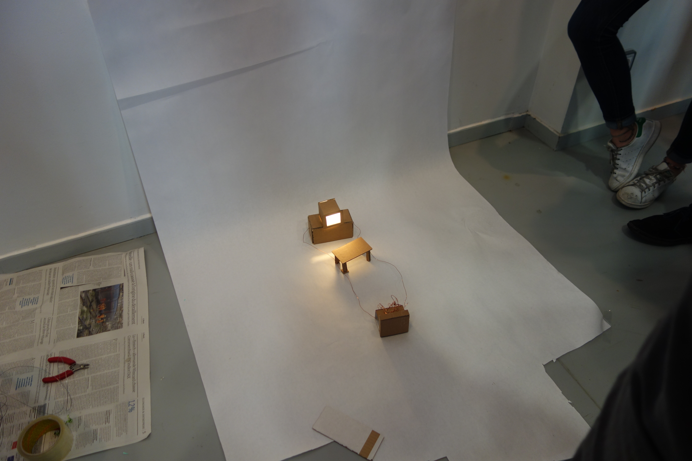
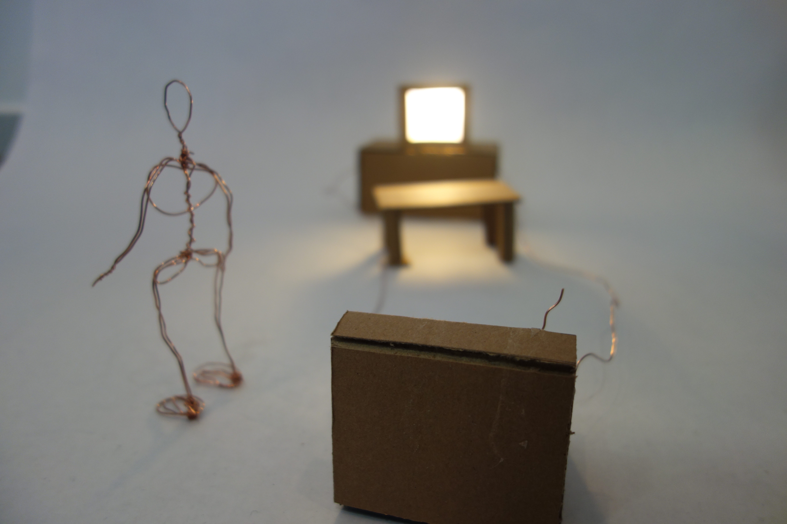
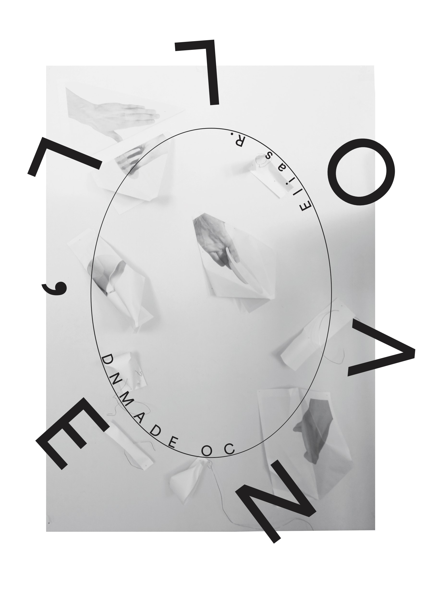
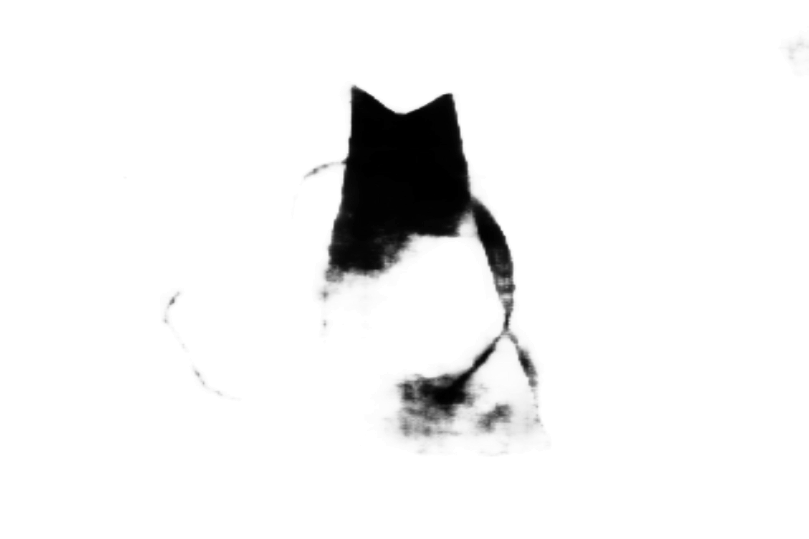
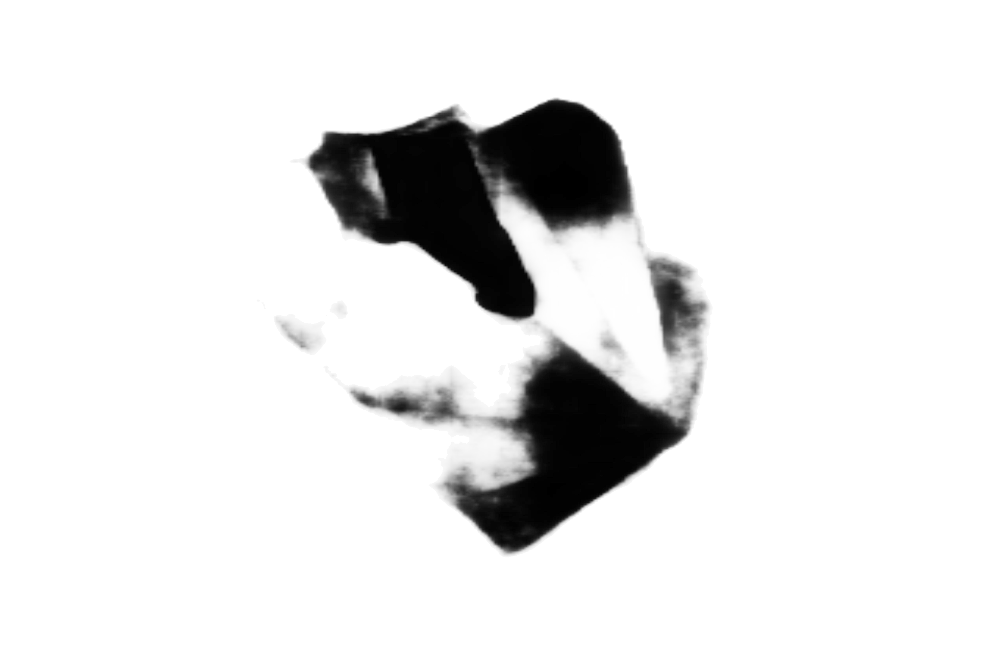
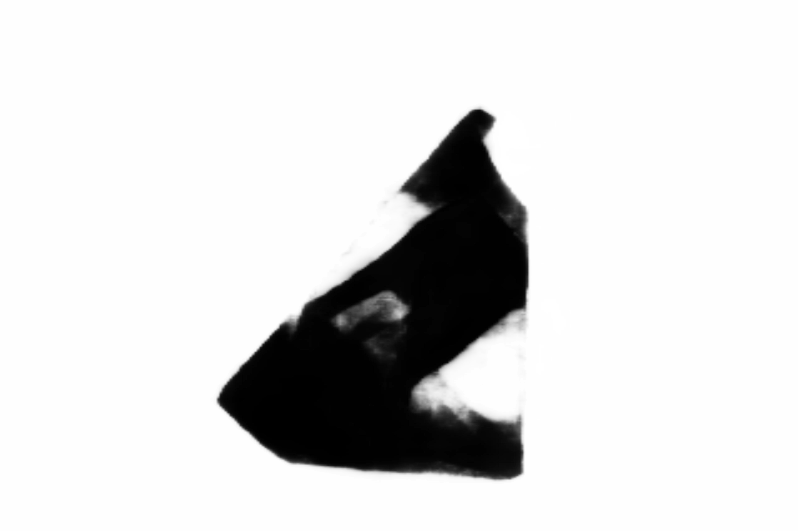

# Workshop

Construire la trame générale d'une fiction à partir d'un impulseur **Catastrophe**.
Analyse, brainstorming, recherche de documentations, citations, références...
Définissez des réponses aux questions de l'en-tête, commencez des croquis d'intention.
Cette fiction se concrétisera, voire se modifiera selon les réalisations effectuées (expérimentations, machines et accessoires, montages...), la trame pourra s'adapter si besoin.

# L'envol
L'envol est la dernière exposition de la Maison Rouge qui a fermé définitivement ses portes en octobre 2018.

## Le Pli

Traite du rêve de s'envoler sans jamais s'intéresser à ceux qui y sont réellement parvenus.

## Salient Object Detection
Tensorflow implementation for CVPR2017 paper
“Deeply Supervised Salient Object Detection with Short Connections”
