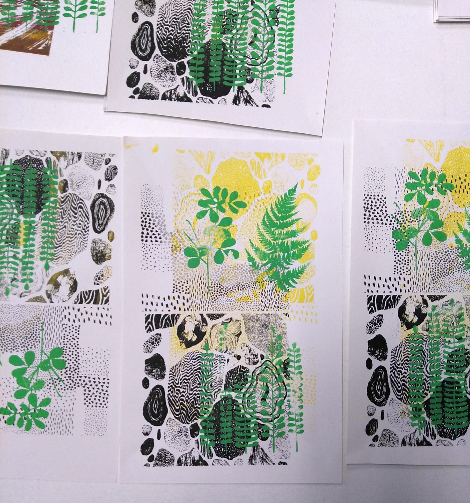
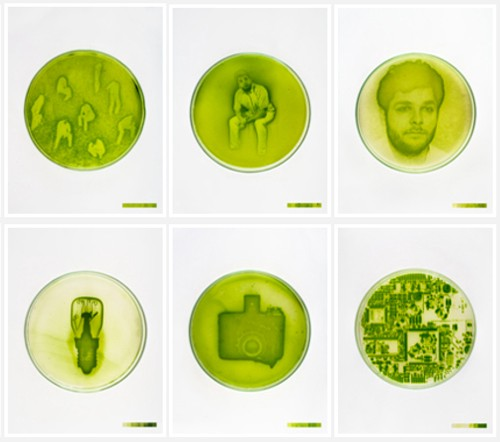
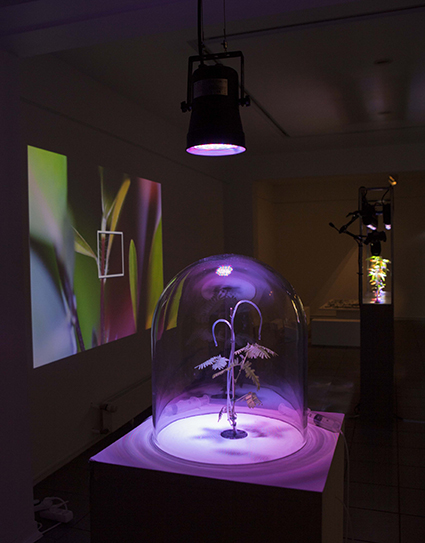
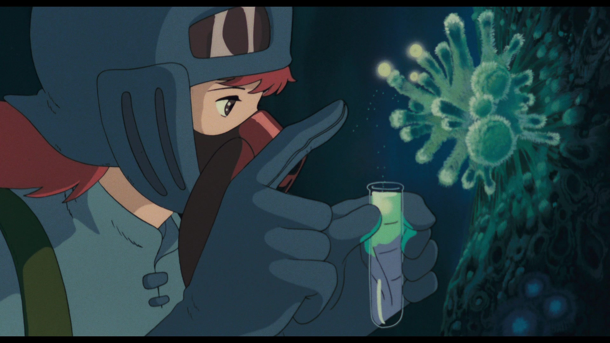
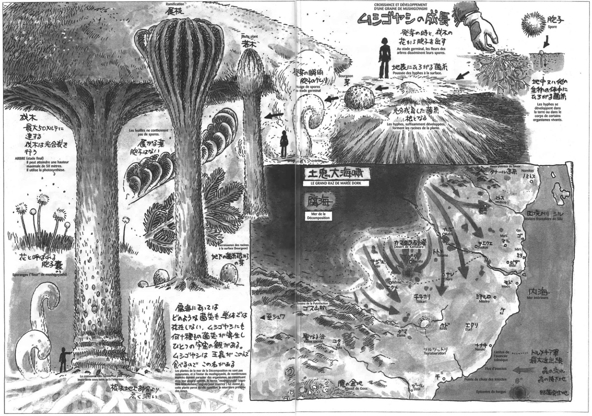
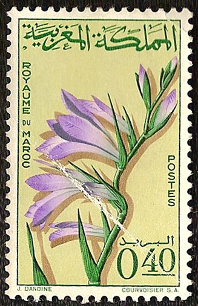
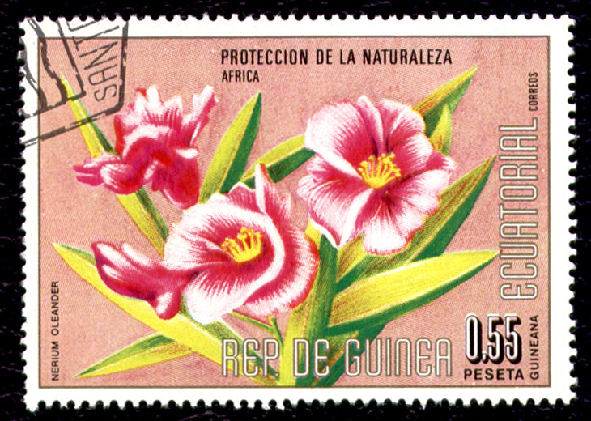
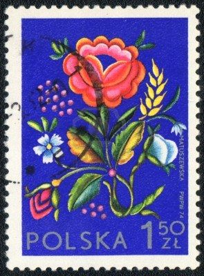

import FloralMindmap from 'components/Content/Mindmap/Floral'
import { SketchComponent } from 'components/Visual/P5js';
import sketch2 from 'components/Visual/P5js/projects/decorationFloral/sketch2';

# Expérimentations florales

Un paysage est une vue d'une portion de l'espace terrestre, perçue par les sens humains ou la photo, vidéo... et représentée ou observée, dans la majorité des cas à l'horizontale et photographiquement par un observateur ; il implique donc un point de vue. Son caractère « résulte de l'action et de l'interaction de facteurs naturels et/ou humains » ajoute le Conseil de l'Europe1.

## Sérigraphie

## Idées de design paramétrique

- Création en fonction de la saison de floraison des végétaux, des légumes et fruits.
- Création en fonction des prévisions des scientifiques sur la végétation donc en fonction du lieu et de l'année.
-

## Outil P5.js

P5.js est en quelque sorte une bibliothèque pour javascript permettant de faire des applications graphiques. Pour la
découvrir on utilisera le site https://www.openprocessing.org ou https://alpha.editor.p5js.org/ (pour du javascript
pur on pourra utiliser codepen.io ou jsfiddle.net). Plus tard on verra comment intégrer nos programmes dans une
page écrite en html/css/javascript.

Plusieurs solutions existent pour coder en p5.js En ligne en utilisant l’éditeur https://alpha.editor.p5js.org/ ou celui du site openprocessing.org. Il possible d’utiliser Processing 3, à télécharger sur le site processing.

<SketchComponent visible={false} style={{height: "600px"}} sketch={ sketch2 } />

# Références

<FloralMindmap style={{height: "100vmin"}} />

## Décoration Florale et Vêtement

[BRRCH](http://www.brrch.com/home) is the NY based floral project of Brittany Asch. founded in 2013, on the principle of delivering flowers as art to heighten the appreciation of the natural world around us.

## Generative art
- [piratefsh](https://piratefsh.github.io/p5js-art/public/lsystems/) L-systems
- [xie-emily](http://xie-emily.com/code_art/algorithmic_plants/index.html) Algorithmic plants
- [dkandalov](https://dkandalov.github.io/lsystem/) L-system

## Open Data & APIs
- [The Garden.org Plants Database](https://garden.org/apps/calendar/?q=Paris%2C+France) When to Plant Vegetables: The Garden Planting Calendar
- [Food Nutrition Information](https://data.world/adamhelsinger/food-nutrition-information) Nutritional information for raw fruits, vegetables, and seafood.
- [Open Climate Data](https://github.com/openclimatedata) This webpage is maintained by Robert Gieseke at the Potsdam Institute for Climate Impact Research.
- [Climate Change Data](https://datahub.io/collections/climate-change) A collection of the most important "general" datasets on climate change.

## Algaegraphie

Les algae-graphies sont des photographies vivantes.
Elles sont crées par des micro-organismes photosensibles capables de capter la lumière et de "développer" des images selon un principe similaire à la photographie classique.

Bouleversant la définition «d’image fixe» habituellement donnée à la photographie, les algae-graphies sont mobiles, autonomes, organique… Une forme ajustée aux mutations d'un médium devenu essentiellement numérique et vivant désormais en symbiose avec l’homme.
Par [Lia Giraud](http://www.liagiraud.com/videos/cultures/)

`video: https://vimeo.com/40735131`
`video: https://vimeo.com/33484152`

### Et pourquoi les algues ?

Je cherchais un capteur capable de matérialiser ces phénomènes lumineux, un capteur vivant. Au début, j’étais partie sur des cellules végétales, des chlorelles, qui sont fixes. Mon idée était de faire pousser des images et qu’elles se développent véritablement. J’ai commencé à expérimenter ces algues en inoculant des boites de Pétri et en essayant de faire apparaître des images avec un négatif posé par contact. Ça ne marchait pas très bien. J’obtenais de vagues formes floues, pas vraiment des images. En plus, ces algues sont particulièrement sujettes aux contaminations. C’était donc très compliqué de travailler avec celles-ci. [Extrait de l'entretien réalisé par Strabic.fr](http://strabic.fr/Lia-Giraud-Algae-graphies)

## Épigénétique

L’épigénétique confère à notre génome une certaine plasticité qui permet aux êtres vivants d’apprendre continuellement de leur environnement et de s’y adapter. Peut-on ainsi imaginer optimiser notre code génétique et développer de nouvelles facultés jusqu’alors dormantes? De récentes recherches ont déjà montré les capacités de la sensible Mimosa Pudica  à s’affranchir durablement de sa peur. En développant ses « aptitudes cognitives », la plante télégraphe nous accordera t-elle la prochaine danse?

## Flower, Jeu vidéo (thatgamecompany, 2009)

Le jeu met en scène des pétales de fleurs portées par le vent. Le joueur contrôle le vent grâce à la fonction de reconnaissance de mouvement de la manette.

Voilà donc plus d’une semaine qu’autour du globe quelques centaines, ou milliers, de joueurs éberlués se prennent pour un pétale de fleur et batifolent à travers champs numériques et luzernes virtuelles pour butiner tout ce qui ressemble de près ou de loin à un pistil. Extrait, Par [Libération](http://archive.wikiwix.com/cache/?url=http%3A%2F%2Fwww.ecrans.fr%2FFlower-power%2C6498.html)

`video: https://www.youtube.com/watch?v=ubmUJcwor3k`

## Nausicaä, Studio Ghibli (1984)

## Fungus

Il s'agit d'un champignon dont les cellules sont indépendantes les unes des autres, mais vivent en groupe où chaque cellule est solidaire des autres. Chacun de ces groupes forme une mousse qui dégage des spores, se déplace sans dispersion et semble pourvu d'une certaine intelligence. Si un groupe dégénère ou si la nourriture vient à manquer, le groupe s'unit avec plusieurs autres et, ensemble, ces groupes forment une boule qui finit par exploser et libérer ainsi une très grande quantité de spores. C'est Nausicaä qui en a étudié un petit groupe pendant son enfance et qui utilise ces informations contre le Fongus géant.

### Mushigoyashi

Le nom de cette plante veut dire "engrais pour insectes". S'il pousse sur un sol "ordinaire" (pollué), il devient un arbre immense qui peut atteindre 50 mètres de haut. Dans ce cas, les racines sont beaucoup plus développées que la partie supérieure de l'arbre. Il constitue alors la nourriture favorite des Ômus. Sinon, il ne devient qu'un petit arbuste stérile.

## Timbres

<!-- ## Vases

[Vase Brindille](http://azambourg.com/portfolio/vase-brindille/) Dernière collaboration avec le Centre International d’Art Verrier de Meisenthal, le vase Brindille est issu d’une réflexion sur le décor à chaud. Se jouant de l’exercice classique du décor verrier végétal, la brindille est insérée entre le verre et le moule. En brûlant, l’élément végétal s’imprime sur le verre.

  -->

# Manifeste

## OGM: Ingérence humaine dans le végétal

Un OGM (Organisme Génétiquement Modifié) est un organisme vivant (animal, végétal, micro-organisme…) dont on a modifié de façon non naturelle, c’est-à-dire par intervention de la main de l’homme, ses caractéristiques génétiques initiales, soit par addition d’un ou plusieurs gène(s) (provenant généralement d’une autres espèce), soit par suppression, remplacement ou modification d’au moins l’un de ses gènes – ou d’un morceau de son matériel génétique (ADN). Il s’agit là de la définition générale, académique. Elle vaut pour tous les OGM, quels qu’ils soient, et quel que soit leur secteur d’utilisation ou d’application.

<!-- # Recherches

## Développement du végétal

La reproduction des végétaux est le moyen pour les plantes de se développer et pour les arbres de faire des fruits. Dans un sens plus large, c'est l'ensemble des moyens qu'ont les plantes pour produire de nouvelles plantes.

-->
