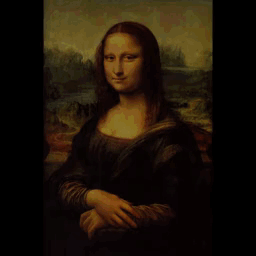

# Design Graphique et Multimédia

## Typography
- Variable Fonts
    - [Spectral, the first parametric Google font by Prototypo.](https://spectral.prototypo.io/)
    - [Axis-Praxis is a website for playing with OpenType Variable Fonts](https://www.axis-praxis.org/)
    - [What’s the Difference Between Variable and Parametric Fonts?](https://eyeondesign.aiga.org/parametric-and-variable-typeface-systems-shape-shifters-for-letterforms/)
- ASCII
    - [Glyph Drawing Club explores the contemporary potential for ASCII-inspired design](https://eyeondesign.aiga.org/procrastinators-unite-now-you-can-create-logos-illustrations-with-any-font-or-glyph-you-like/)
- SVG
    - [dotgrid](dat://dotgrid-neauoire.hashbase.io/) SVG Icon Tool

### Open Source Fonts
- [UseModify](https://usemodify.com/) Use & Modify is a personal selection of beautiful, classy, punk, professional, incomplete, weird typefaces. Open source licenses make them free to use and modify. This selection is the result of deep search and crushes. A project initiated by Raphaël Bastide.
- [Work Avec](http://osp.kitchen/foundry/work-avec/) Par Pierre Huyghe-Baert
- [Beautiful Web Type](https://github.com/ubuwaits/beautiful-web-type) I am building the definitive resource for open-source type

### Licensed Fonts
- [Proxima Nova Web Fonts](https://github.com/elliakou/proxima-nova-web-fonts) Proxima Nova is american type designer Mark Simonson's most popular font family, a beautiful geometric-grotesque sans-serif that he created in 1994.

### People
- [Julie Blanc](http://julie-blanc.fr/) Research student at @EnsadLab | Working on @pagedmedia_org | Member of @prepostprint | Design, CSS print, browser-based publications, workflows & code
- [Floriane Rousselot](http://florianerousselot.com/) Graphic designer, South of France. Founder of @typelab.fr
- [Frederik Berlaen](http://typemytype.com/) Works under the name of TypeMyType providing font services, programming and teaching at Luca School of Arts Ghent and at ESAD in Amiens.

## Data Visualisation
- [Manycities](http://www.regarde.org/portfolio/manycities) Explorez l'activité humaine dans plusieurs métropoles internationales au travers des données générées par les réseaux de télécommunications mobiles.
- [Timeline of technologies for publishing (1963-2018)](https://gitlab.com/JulieBlanc/timeline-publishing) Sections of the timeline: Hardware, OS & platforms Reading softwares Publishing softwares Softwares and systems for text Web-based technologies Formats and languages

## Creative coding
- Creative Code: Aesthetics + Computation
- Generative Coding Libraries
- http://printingcode.runemadsen.com/examples/

### People
- [Pierrick Thébault](http://www.regarde.org/) Pierrick est un chercheur en design et un praticien intéressé par les systèmes complexes, la visualisation de données et les environnements connectés.
- [xorxor](https://www.xorxor.hu/about.html)
- [vibertthio](https://github.com/vibertthio/etude) Thio defines himself as a poetic technologist, playing around the disciplines of music, art, and technology. He develops a wide variety of projects, including interactive machine learning, audio/visual web pages, diverse musical instruments, and art rehabilitation. https://medium.com/@vibertthio/beact-audio-visual-art-in-react-44e9c757e40f
- [Thijs Koerselman 0x80](https://github.com/0x80) Design applications, interactive systems and websites. Love using technology in creative contexts.
- [Sarah Rothberg](http://sarahrothberg.com/) Sarah Rothberg is an artist who captures the interplay between technology, systems, and the personal, creating meaning through unique and strange interactions. Her idiosyncratic experiences suggest other ways of remembering, thinking, understanding, and communicating.

## Recherche Visuelle
- [Thisisipaper](https://thisispaper.com/) This is an ongoing visual research by Thisisipaper Studio.

## Collections et Dépôts Git
- [Open Source Publishing](http://osp.kitchen/about) OSP makes graphic design using only free and open source software—pieces of software that invite their users to take part in their elaboration.
- [dcfvg](http://dcfvg.com/)
- [nwc-viewer](https://github.com/zz85/nwc-viewer) open source noteworthy composer music notation viewer & player
- [Panwriter](https://github.com/mb21/panwriter) Innovative approaches to making books in browsers. See paged media blog.
- [fluid_sim](https://github.com/nestarz/fluid_sim) An implementation of the article "Fast Fluid Dynamics Simulation on the GPU", using C++ and OpenGL 3.3.

- [Elements of Physics](https://elements-of-physics.surge.sh/) Elements of Physics is an interactive simulation which describes different elements of physics like Gravity, Acceleration and Force. Each element is described with different simulation controls.

## People
- [Annika Frye](https://www.annikafrye.de) Annika Frye is a german designer and design researcher. She works in between practice and theory. Annika’s interests concern the aesthetic qualities of serial production, experimental processes and the design process as source of innovation. She has recently published her dissertation on improvisation in design. After finishing her PhD-project on improvisation at the  University of Art and Design Offenbach she started researching the changes of design processes regarding the connection of digital technology and materiality.
- [Aven Le Zhou](https://www.aven.cc/index.html) Le Zhou, also known as Aven, is an anti-disciplinary designer and technology enthusiast based in Shanghai.His recent focuses are on interactive media, creative coding, computer vision, computational geometry and digital fabrication. He now works as a consultant at Interactive Media Arts Program at NYU Shanghai and an adjunct professor at New Media and Communication Program at Shanghai Art and Design Academy.
- [Pia Pandelakis](http://piapandelakis.com/) Enseignant-chercheur en design à l’Université Toulouse - Jean Jaurès. recherches visent à esquisser la possibilité d’un Queer[ed] Design.
- [Tim Knapen](https://www.timknapen.be/projects/) Artist and designer working with digital technologies.
- [Albertine Meunier](https://www.albertinemeunier.net/) Albertine Meunier pratique l’art dit numérique depuis 1998 et utilise tout particulièrement Internet comme matériau. Elle se définit elle-même comme une net artiste, artiste pas nette. Cette expression bien que légèrement désuète - un net artiste étant tout simplement un artiste de son temps - contribue à lui conférer un visage humain, bien loin de la froideur des machines numériques.
- [Patrick Tresset](http://patricktresset.com/new/) Patrick Tresset is a London based artist who develops and presents  theatrical installations with robotic agents as actors which are evocations of humanness. Tresset’s installations use computational systems that introduce artistic, expressive and obsessive aspects to robots’ behaviour.
- [Samuel Bianchini](https://twitter.com/dispotheque?lang=fr) Artiste et enseignant-chercheur à l'EnsAD - PSL, Paris, responsable du groupe de recherche Reflective Interaction d'EnsadLab et de la Chaire arts et sciences
- [Benoît Verjat](http://benoit.verjat.com/) Chercheur en design et art, enseignant, g-u-i, dcfvg, médialab, ENSA
- [Julien Gargot](https://gargot.co/) Un designer d’interactions, designer de services et développeur basé à Paris.
- [Ivan Murit](http://ivan-murit.fr) Génère et agence les formes visuelles à l'aide de modèles de phénomènes naturels.
- [Matt DesLauriers 🔥](https://www.mattdesl.com/) Designs and develops creative technology projects, including digital installations, rich 3D web experiences, generative art, interactive games, data visualizations, and more.
- [Ralf Baecker](http://www.rlfbckr.org/about.html) Artist working at the interface of art, science and technology
- [Vincent Duc](http://vincent.duc.ensad.fr/) Designer graphique & Directeur artistique, ENSAD, Paris
- [Wang Zhihong](http://wangzhihong.com/) Leading graphic designer based in Taiwan and a member of AGI (Alliance Graphique Internationale)
- [Brannon Dorsey](https://brannon.online/) Artist, programmer, and researcher based in Philadelphia, PA
- [Gene Kogan](http://genekogan.com) Artist and programmer who is interested in generative systems, computer science, and software for creativity and self-expression.
- [Raphaël Bastide](https://raphaelbastide.com/) Artist and instructor based in Paris, my work is mainly relating to the digital and computer program culture.
- [Pierre Bertet](https://pierre.world/)
- [Patricio Gonzalez Vivo](http://patriciogonzalezvivo.com/about.php) Artist and engineer who uses code and light to turn data into stunning landscapes.
- [Alexander Buzin](https://alexbuzin.me/#about) Creative web designer & VR artist from Kiev, Ukraine.

## Collectifs
- [g.u.i](http://www.g-u-i.net) Un collectif créé en 2007 à Paris par Nicolas Couturier et Bachir Soussi-Chiadmi qui rassemble aujourd’hui (Nov. 18) Nicolas Couturier, Sarah Garcin, Julien Gargot, Angeline Ostinelli, Benoît Verjat et Tanguy Wermelinger et qui collabore avec des institutions culturelles et des collectivités publiques, des associations, des artistes et des chercheurs en mettant en œuvre le design graphique, interactif, éditorial, in situ, méthodologique, et la performance.
- [Vraiment Vraiment](http://www.vraimentvraiment.com/) "Transformer les politiques publiques et les acteurs publics en partant de l’expérience usager et de l’expertise des agents. Pour cela, nous aidons les acteurs publics à comprendre le présent et à se projeter dans le futur pour concevoir, mettre en œuvre et évaluer des politiques publiques
plus pertinentes, plus soutenables et plus efficaces."
- [Design Friction](https://design-friction.com/) "Nous sommes un studio de design fiction qui produit des scénarios spéculatifs et critiques pour les présents à venir."

## Studios
- [Thisisipaper Studio.](https://studio.thisispaper.com/) Thisisipaper is an international and multidisciplinary design studio established in 2011 by Alexander Zakharov and Zuzanna Gasior concentrating on the human side of design. Our team includes architects, designers, writers, developers.
- [Indianen](https://www.indianen.be/) Constantly searching for new ways of approaching a project, we like to work with new technologies as well as traditional materials. We happily move from well designed print to interactive projects using custom software or electronics.

## Groupes de Recherche
- [Reflective Interaction](http://reflectiveinteraction.ensadlab.fr/) Reflective Interaction est un groupe de recherche en art et en design avec et sur les dispositifs interactifs. Le groupe Reflective Interaction se confronte à la problématique suivante : comment et pourquoi concevoir, réaliser et expérimenter des dispositifs artistiques interactifs qui articulent des dimensions esthétique, symbolique et opératoire au profit d’expériences autant sensibles que réflexives, et cela en investissant des champs sociotechniques prospectifs interrogeant nos relations d’interdépendance avec nos environnements humains et non-humains : l’interaction de groupe, les objets robotisés, les nouveaux matériaux actifs et réactifs voire vivants, les éditions interactives multi-supports non-basées sur le texte ?

# Conférences et Festivals

## Multimedia Arts et Design
- [Eyeo Festival](https://vimeo.com/eyeofestival) Since 2011, the annual Eyeo Festival brings together a community of people drawn to the intersection of art, data and creative technology
- [GROW](https://www.grow.paris/fr/infos/) Rendez-vous parisien (et plus seulement!) des codeurs créatifs. GROW cherche à ouvrir les possibles de la création numérique.
- [EvoMUSART](http://www.evostar.org/2019/cfp_evomusart.php) The use of Computational Intelligence for the development of artistic systems is a recent, exciting and significant area of research. There is a growing interest in the application of these techniques in fields such as: visual art and music generation, analysis, and interpretation; sound synthesis; architecture; video; poetry; design; and other creative tasks.

# Résidences

## Media Artists
- [European Media Art Platform / European Media Artists in Residence Exchange 2019](https://call.emare.eu/) The new European Media Art Platform offers residencies for media artists in the fields of digital media including Internet and computer-based artists, filmmakers, and those working in media based performance, sound or video as well as robotics or bio-art.

# Machine Learning

## Journals
- [Distill](https://distill.pub/) Machine Learning Research Should Be Clear, Dynamic and Vivid. Distill Is Here to Help.

## Schools
- [MA Interaction Design Communication](http://18.int-des.com/#fh5co-started) University of the Arts London

## Creative Coding and Design
- [NIPS Machine Learning for Creativity and Design](http://nips4creativity.com/) This is a collection of art, music and design using machine learning. It is part of the NIPS Machine Learning for Creativity and Design Workshop 2017.
- [ECCV Computer Vision Art Gallery](https://computervisionart.com/) Recent practice in computer vision and AI art.
- [Machine Learning for Artists](https://ml4a.github.io/ml4a/) Notes, demos, interactive visuals, art projects, references, further readings, etc.
    - [The Neural Aesthetic @ ITP-NYU, Fall 2018](https://ml4a.github.io/classes/itp-F18/)

## Datasets
- [Google Dataset Search](https://toolbox.google.com/datasetsearch)

## Implementations
- [lc0-js](https://frpays.github.io/lc0-js/engine.html) Chess engine designed to play chess via neural network
- [Dmitry Kurtaev/ Style Transfer](https://dkurtaev.github.io/style_transfer.html) This is a demonstration of Fast Neural Style deep learning networks by Justin Johnson, Alexandre Alahi and Li Fei-Fei using OpenCV.js.
- [Tone Analyzer](https://tone-analyzer-demo.ng.bluemix.net/) This service uses linguistic analysis to detect joy, fear, sadness, anger, analytical, confident and tentative tones found in text.

# Ceramics Design

## Manufactures et Musées
- [Manufacture nationale de Sèvres](https://www.sevresciteceramique.fr/)
- [Manufacture Bernardaud](https://www.bernardaud.com/)
- [Four des Casseaux](https://museedescasseaux.com/)
- [Musée national Adrien Dubouché](http://www.musee-adriendubouche.fr/)
- [Centre de Transfert de Technologies Céramiques](http://www.cttc.fr/)

## Impression Numérique
- [Exposition Sans Les Mains - Bernardaud](https://www.bernardaud.com/fr/actualites/exposition-sans-les-mains) L’exposition Sans les mains ! a lieu à un moment charnière, la céramique entre dans un nouveau chapitre de son histoire vieille de 25 000 ans avec la technologie numérique qui complète la boîte à outils de l’artiste par de nouveaux procédés qui autorisent la fabrication d’œuvres d’art auparavant impossibles à réaliser.

## Projects
- [Déformations Continues](http://suzylelievre.fr/recherches/deformations-continues-4) Cette recherche est fondée sur un protocole de déformation paramétrique appliqué à différents contextes.

## People

- [Pia Van Peteghem](https://www.piavanpeteghem.com/) Elle poursuit aujourd'hui sa formation en modelage plâtre, auprès de Céline Turpin, afin de maitriser parfaitement les techniques et utilisations de ce matériau, allié incontournable de l'argile. Pia n'abandonne par pour autant son travail sur les pièces "utilitaires", créant une gamme d'objets destinés  à tenir dans "le creux de la main", à regarder au quotidien.
- [Marion Graux](http://www.mariongraux.com/marion/) Des études d’arts plastiques, des détours dans la mode, le design et la presse, et je m’embarque vers d’autres joies. En 2010, j’apprends la céramique près d’un maître potier. Le plaisir est plein. Le tour, les émaux, les formes, la ligne, les matières, les brillances… je découvre.
- [Elisa Uberti](https://www.elisauberti.com/) La nature minérale, organique et sauvage, le minimalisme discret, le nomadisme, les parures tribales, l'architecture et la poésie de l'espace... Des inspirations multiples mais un même fil conducteur, celui de l'artisanat, le respect du temps qui passe et un besoin d'intemporalité.
- [Caroline Prévost](https://www.carolineprevost.fr/) Textiles, métalliques, végétales ou minérales, les matières me fascinent, initient mes créations et influencent mon parcours.

### 3D Print
- [Dylan BECK (USA)](https://www.dylanjbeck.com/resume/)
His artwork explores the interaction of human activities with the natural environment and the idea that we are currently living in the Anthropocene, where human activities have had a significant global impact on the Earth's ecosystems.
- [Bryan CZIBESZ (USA)](http://www.bryanczibesz.com/Home.html)
Bryan Czibesz is an artist grounded in the tradition of object making who asks questions of authorship and authenticity through varying degrees of engagement and dislocation between the hand and material manipulation.
- [Michael EDEN (UK)](http://www.michael-eden.com/about/)
A maker whose work sits at the intersection of craft, design and art, exploring contemporary themes through the redesign of historical, culturally familiar objects utilising digital manufacturing and materials.
- [Jennifer GRAY (UK)](https://www.jennifergray.co.uk/About)
Exploring how craft and design processes of re-making/reconstruction can be used to reinterpret and gain new perspectives on historical objects. Through her own practice she produces objects in a range of materials using techniques, which move in and out of the hand-made, and digital.
- [Flemming TVEDE HANSEN (Denmark)](http://flemmingtvede.dk/index.html) Focus on the relationship between crafting materiality and digital representation, and how experiential knowledge of crafts rooted in ceramics can be utilized in the use of digital technologies.
- [Del HARROW (USA)](https://www.delharrow.net/instructions/)
Use a range of processes to make work, from direct hand-building with coils and slabs of clay to computer aided design, parametric modelling, and computer controlled machines for fabrication.
- [Olivier VAN HERPT (Netherlands)](http://oliviervanherpt.com/about/)
Out of paraffin and even clay, he has printed collections of objects that soften the precise and indifferent definition of industrial design. Vases seemingly handwoven by the hands of individual artisans, ceramics crafted with random imperfections, and pottery shaped by the environment they were made in—these manufactured objects demonstrate how van Herpt reinserts humanity into the man-made machine.
- [Toshiya MASUDA (Japan)](https://masutoshi117.jimdo.com/concept/)
Use traditional materials and techniques to achieve digital effect helping to think about “the reality of this age” which consists of virtual world and the real world.
- [Megumi NAITOH (Japan)](http://www.meguminaitoh.com)
The combination of unfamiliar elements is a consistent idea running though her work. She conceived with Anna Andersen the Ceramic Commons project.
- [John RAINEY (UK)](http://johnrainey.co.uk)
- [Shawn SPANGLER (Hawaii)](http://www.shawnspangler.com/biography/)
Ceramic artist who draws inspiration from craft, industrial design and digital technology. His installation projects raise questions concerning authorship and commoditization of objects, highlighting the connections and margins between digital and analog processes of producing ceramic vessels.
- [Chris WIGHT (UK)](http://www.cone8.co.uk/profile-chris-wight/)
He is one of that rare breed of designer makers whose output transcends categorisation, who works with a range of materials, and shifts easily from traditional tools and techniques to the latest technology

## Studio
- [Emerging OBJECTS (USA)](https://www.emergingobjects.com/about/)
Independent, creatively driven, 3D Printing MAKE-tank specializing in innovations in 3D printing architecture and building components.
- [Studio JOACHIM-MORINEAU](http://studiojoachimmorineau.com/about.html) Design studio founded by Carla Joachim and Jordan Morineau, based in Eindhoven (NL). Their work is a mix of crafts, industrial techniques and technology. They use experimentation to push the limits of each field.

## Ateliers et Résidences
- [CRAFT](http://www.craft-limoges.org/) Atelier de recherche et de création contemporaine, il accompagne la création contemporaine en céramique, tout en jouant un rôle d’interface entre l’art et l’industrie en invitant des créateurs du monde entier à faire sortir la céramique de la « table » et en misant sur l’innovation.
- [Ateliers Jouret](http://ateliersjouret.fr/) Ateliers d'artistes, studio de danse, cours, cafèt' associative, espace d'exposition, recyclerie...

## Courses
- [Matériaux céramiques haute performance : de l'élaboration à leurs propriétés thermiques et mécaniques](https://www.fun-mooc.fr/courses/course-v1:ensci+39001+session02/about) Ce cours a pour objectif de vous faire découvrir le monde de la science des matériaux minéraux.

## Magazine & Journals
- [dezeen](https://www.dezeen.com/tag/ceramics) Dezeen is the world's most popular and influential architecture and design magazine, and the winner of numerous awards for journalism and publishing.

# Object Design

## People
- [Se Yoon Park](http://seyoonpark.com/) Grâce aux technologies d’impression 3D, cet architecte et designer de formation a ainsi pu créer une série de sculptures florales inspirées par son enfance à la campagne. Pour la partie fabrication, Se Yoon a fait appel aux services de i.Materialise qui a eu recours à des imprimantes 3D à frittage de poudre pour produire les sculptures.
- [James Auger and Jimmy Loizeau](http://www.auger-loizeau.com/contact) [Industrial] Design is mostly concerned with the process of bringing products to market – making them desirable and therefore saleable. By removing the commercial aspect from the development of the [designed] object, it can be given a different agenda, investigating the process that gives birth to it rather than being defined by it.
- [Sophia Brueckner](http://sophiabrueckner.com/index.html) Artist, designer, and engineer. Inseparable from computers since the age of two, she believes she is a cyborg.
- [Baptiste Meyniel](https://www.instagram.com/baptiste.meyniel/) Diplômé de l'ENSCI et de l'ENS Cachan. Sa pratique s'ancre dans une recherche par la matière, visant à révéler les qualités plastiques et les contraintes inhérentes au matériau. Liée à la force graphique du dessin, son exigence est de concevoir des objets simples mais singuliers dans leur forme, justes dans leur mise en œuvre et effectifs dans leurs usages.
- [Clementine Chambon](http://www.designpercept.com/) Clémentine Chambon est la première à participer à la nouvelle résidence de recherche en design ouverte par l’ENSCI. C’est à ce titre que l’ENSCI lui a demandé d’animer une séance de son programme Design en Séminaire, autour de la thématique de son projet, Paperwork.

## Projects
- [Paperwork](https://www.instagram.com/paperwork_project/) Explore l’assemblage de semi-conducteurs OLED Organic Light-Emitting Diode une technologie de lumière surfacique réalisée par empilement de couches à l’échelle nanométrique et du papier, matériau à la fois historique, quotidien, accessible. Cette démarche interroge l’histoire et l’usage du matériau, ses techniques associées, engage de nouveaux modes de production.
- [Real Prediction Machines](http://www.auger-loizeau.com/projects/real-prediction-machines) Predicting the future is no longer about the mystical reading of natural and celestial phenomena. Today it is all about data.
The Real Prediction Machine (RPM) is a domestic product that uses big and small data, in combination with machine learning and predictive modelling to make predictions about specific future events.

## Studios
- [Design Percept](http://www.designpercept.com/) Design Percept est un studio de design situé à Paris et propose une nouvelle vision du design et du textile. Leur passion est d’aborder les matériaux, les couleurs et les formes
Du concept à la réalisation de produit, elles revendiquent une élégance, une simplicité, une justesse.
- [GOODMOOD Laboratory](https://www.goodmoodlaboratory.com/) Our process is looping from Generation to Evaluation until it leads to a meaningful interaction and experience. This way, you are able to make creative decisions with a conscious vision of your Design directions.
- [Material Evolution Lab](http://materialevolutionlab.com/)  Specialist laboratory for the design, development and application of material innovations.
- [Pili](pili.bio) Through biotechnology, PILI conjugates the performance of the chemical industry with the renewability of biology to cope with the challenges of a clean color production.
- [Agence GG](http://agencegg.fr) GG définit donc sa pratique panachée par la capacité à user de n’importe quel outil, matériau, méthode, collaboration ou système de pensées à sa portée et de les mélanger sans a priori et sans aucune restriction.

## Plateformes
- [Le French Design](https://www.lefrenchdesign.org/) Plateforme de rencontres, de tendances et d'exposition du design français

# Food Design and Cooking

## People
- [alexfrenchguycooking](https://www.youtube.com/user/FrenchGuyCooking) Self-taught home cook and make “different” food videos over on YouTube. Like that time when he made a Dry-Aged-Beef Machine inside my own fridge, or that time when he recreated a Neapolitan Pizza using a domestic oven, or even that time when he tattooed the blade of my beloved chef knife.
- [cookingwithalia](https://www.youtube.com/user/cookingwithalia) For her Moroccan cuisine is more than just food for the body; it’s comfort for her soul.
- [Peaceful Cuisine](https://www.youtube.com/user/ryoya1983) Ryoya from Japan doing cooking videos(all vegan), Travel vlogs, Time-lapses, DIY and pottery throwing.
- [Brothers Green Eats](https://www.youtube.com/channel/UCzH5n3Ih5kgQoiDAQt2FwLw) Brothers Green explore a world that is hungry to learn how to cook without all of the fancy gadgets, pro kitchens and expensive ingredients.

# Design de service

## Studio
- [Les Sismo](http://www.sismodesign.com/fr/) Dans notre pratique de designers, par expérience comme par conviction, nous attachons autant d’attention aux idées qu’aux personnes : vous, vos clients, vos patients, vos citoyens, vos usagers, vos partenaires, vos collaborateurs…
- [Meaningful](http://www.meaningful.fr/work) Nous accompagnons les grands groupes et les startups dans l’identification des besoins clients et le lancement de produits et services désirables.

# Société

## Work
- [The Designer-Developer spectrum](http://markdotto.com/2013/04/22/designer-developer-spectrum/)

## IA vs Art
- [L'intelligence artificielle va-t-elle créer un art plus humain ?](https://www.franceculture.fr/emissions/du-grain-a-moudre/lintelligence-artificielle-va-t-elle-creer-un-art-autonome)
Quand on fréquente des artistes qui veulent s'y frotter. La collaboration n'est pas évidente, on est plutôt dans des confrontations. On essaie peut-être aussi de décaler, d'incarner la technologie, de pouvoir la hacker. L'outil en lui même va reproduire sans fin, une infinité d'images par exemple. Donc après, comment on intervient ? Est-ce qu'on va vouloir perturber le système ? On parlait de Patrick Tresset [...] c'est peut être dans le raté que l'incarnation de l'IA est interéssante. L'artiste pourra piéger ces programmes là. Il y a plein de possibles. On réduit actuellement à la création d'une seule image.

## Plateformes
- [Peertube](https://joinpeertube.org/fr/) L’hébergement de vidéos décentralisé, en réseau, basé sur du logiciel libre
    - [Video: Contre la censure, la décentralisation](https://video.lqdn.fr/videos/watch/667505c9-c156-4c0b-a8dd-74d8b160ece5)
- [Mastodon](https://joinmastodon.org/) Suivez vos amis et découvrez-en de nouveaux. Publiez ce que vous voulez : liens, images, textes, vidéos. Tout ça sur une plateforme appartenant à la communauté et sans publicités.

### MOOC
- [moocdigitalmedia](http://moocdigitalmedia.paris/) Les cultures et pratiques numériques sont aujourd’hui l’affaire de tous. Elles sont transversales à bien des domaines, allant des arts visuels aux arts appliqués, jusqu’au spectacle vivant. Aussi, les contenus du moocDigitalMedia.paris sont accessibles à tous. A tous ceux désireux d’améliorer leur savoir-faire en s’appropriant des connaissances inhérentes aux pratiques innovantes qui sont à la croisée des réseaux, des jeux vidéo, du design d’interaction, des nouvelles images, de la data visualisation, du mapping vidéo ou de la générativité en son.

## People
- [Benjamin Bayart](http://edgard.fdn.fr/cv.html) L'imprimerie a permis au peuple de lire, Internet lui a permis d'écrire.

## Biotechnology vs Mode
- [Fashion Geek](https://www.youtube.com/watch?v=nOnbLLB8w90) A l'aide des créateurs qui font et pensent le vêtement de demain, "Fashion Geek" explore les nouvelles synergies entre mode et technologie, et questionne les ...

# Learning
## mathematics
- [Immersivemath](http://immersivemath.com) The world's first linear algebra book with fully interactive figures.

# Music Design

## Search engine
- [Midomi](https://www.midomi.com) Find music

## Learn Music
- [learningmusic.ableton](https://learningmusic.ableton.com) Made with Tone.js

## Creative Music Coding
- [Aleś Curko](https://twitter.com/Al_Tsurko) Neo-cyber-algo-post-гоп-math-composer
- [Tone.js Demos](https://tonejs.github.io/demos)
- [modV by Sam Wray/2xAA]() A real time music visualisation VJing platform for use in live-performance contexts. Great with some chiptune!
- [audiotrainer-server by Number-42.]() A simple program meant to correlate increases in heart rate in ASD-diagnosed children to changes in the features of ambient sounds (both sets of data prerecorded over the same period of time) with the intent of optimizing a training program helping them cope with sounds abnormally stress-inducing to them.
- [OSEM by @uduk]() A computer generated melody project, optionally users can plug-in their guitar and/or MIDI key controller to dictate input harmonic. Meyda.js is being used to extract audio signal features, such as beat dynamic and music segmentation in order to help OSEM to produce high-quality music melody. It is meant to answer the question: “Given an arbitrary backing track (format: wav, mp3) can computer compose?”

Picognizer by @qurihara
Picognizer is the 100% JavaScript library for detecting synthesized sounds (e.g. sound effects of video games, replayed speech or music, and sound alerts of home appliances). You can run it on your web browser without any server-side systems.

# Front-End
- [Awesome-Git: The most essential list of resources for Front-End beginners](https://github.com/thedaviddias/Resources-Front-End-Beginner#learn-html)
- [Mozilla: Getting started with the web: Dealing with files](https://developer.mozilla.org/en-US/docs/Learn/Getting_started_with_the_web/Dealing_with_files)
- [Mozilla: So what is HTML, really?](https://developer.mozilla.org/en-US/docs/Learn/Getting_started_with_the_web/HTML_basics)
- [Mozilla: So what is CSS, really?](https://developer.mozilla.org/en-US/docs/Learn/Getting_started_with_the_web/CSS_basics)

## HTML
HTML signifie Hypertext Markup Language. Il est utilisé pour structurer un site web.

- [101 HTML - Mozilla HTML](https://developer.mozilla.org/fr/docs/Apprendre/HTML)
- [Shay Howe: Building Your First Web Page 🔥](https://learn.shayhowe.com/html-css/building-your-first-web-page/)
- [Shay Howe: Getting to Know HTML 🔥](https://learn.shayhowe.com/html-css/getting-to-know-html/)
- [Lynda: HTML Essential Training](https://www.linkedin.com/learning/html-essential-training)

## CSS
CSS est l'acronyme de Cascading Style Sheets.

- [Mozilla CSS](https://developer.mozilla.org/fr/docs/Web/CSS)
- [Shay Howe: Getting to Know CSS 🔥](https://learn.shayhowe.com/html-css/getting-to-know-css/)
- [CSS Specificity](https://developer.mozilla.org/fr/docs/Apprendre/CSS/Introduction_%C3%A0_CSS/La_cascade_et_l_h%C3%A9ritage)
- [Learn CSS Layout](https://learnlayout.com)
- [SoloLearn](https://www.sololearn.com/Course/CSS/)
- [CSS Tricks](https://css-tricks.com/)
- [CSS Grid](https://developer.mozilla.org/fr/docs/Web/CSS/CSS_Grid_Layout)
- [30 Seconds of CSS](https://30-seconds.github.io/30-seconds-of-css/) A curated collection of useful CSS snippets you can understand in 30 seconds or less.

### Cheatsheets
- [CSS Units, Recommended Use](https://www.w3.org/Style/Examples/007/units.en.html) W3C has a great post on the subject of CSS units.

### Videos
- [DevTips on YouTube: CSS Basics](https://www.youtube.com/watch?v=s7ONvIgOWdM)
- [DevTips on YouTube: CSS Positioning](https://www.youtube.com/watch?v=kejG8G0dr5U)
- [Video Tutorials par Rachel Andrew](https://gridbyexample.com/video/)
- [Lynda: CSS Essential Training](https://www.lynda.com/CSS-tutorials/CSS-Essential-Training-1/569190-2.html)

### Interactive Learning
- [Flexbox in 5 Minutes](https://cvan.io/flexboxin5/)
- [Flexbox Defense](http://www.flexboxdefense.com/)
- [Flexbox Forggy](http://flexboxfroggy.com/)
- [CSS Diner](https://flukeout.github.io/)
- [Grid Garden](http://cssgridgarden.com/)

## Javascript
- [Javascript30](https://javascript30.com/) 30 Day Vanilla JS Coding Challenge
- [ES6.io](https://es6.io) A premium training course to strengthen your core JavaScript skills (Paid).
- [Node.js](https://oncletom.io/node.js/) Apprendre par la pratique, Familiarisez-vous avec JavaScript, Node.js et l'écosystème de modules npm. Apprenez à concevoir et à déployer des applications web et des outils en ligne de commande.
- [Learn JavaScript](https://learnjavascript.online/) The easiest way to learn & practice modern JavaScript

### Dépôts
- [nlp-compromise](https://nlp-compromise.github.io/) modest natural-language processing in javascript
- [sentiment-analysis](https://masta-g3.github.io/linear-content/sentiment-bukowski.html) Bukowski's Poems Sentiment Analy
- [blackout poetry generator](https://mkremins.github.io/blackout/) Turns any web page into a work of procedurally generated blackout poetry!
- [Mkcert valid https certificates for localhost](https://blog.filippo.io/mkcert-valid-https-certificates-for-localhost/) mkcert is a simple by design tool that hides all the arcane knowledge required to generate valid TLS certificates.

## People
- [Milan Gress - Introduction aux prototypes numériques](https://milangress.github.io/thinker-tailor/ressourcen/)

## Freelance Plateforms
- [404works](https://www.404works.com/)
- [iziday](https://iziday.com/)
- [malt](http://malt.fr)
- [Acmé](https://www.joinacme.co)

# Python

## Tutorials
- [Python Tutorial: List Comprhension](https://www.youtube.com/watch?v=5i1KVySiu78) In this short Python #Programming tutorial I explain how to use List Comprehensions ny using a simple example to filter a shopping list.

# Computer Graphics and Image Processing

## Online Books and Ressources
- [Introduction to Computer Graphics, David J. Eck, 2018](http://math.hws.edu/graphicsbook/c5/) Free, online textbook covering the fundamentals of computer graphics and computer graphics programming. From OpenGL to WebGL with Three.js and to Blender.
- [webgl-workshop](https://github.com/stackgl/webgl-workshop) Learn the WebGL API with an interactive learning process
- [Geometry processing](http://school.geometryprocessing.org/) In this research area, concepts from mathematics, computer science, and engineering are studied and applied to offer new insights and design efficient algorithms for acquisition, modeling, analysis, manipulation, simulation and other types of processing of 3D models and shape collections.
- [Turtle graphics](https://en.wikipedia.org/wiki/Turtle_graphics) In computer graphics, turtle graphics are vector graphics using a relative cursor (the "turtle") upon a Cartesian plane. Turtle graphics is a key feature of the Logo programming language.[1]
- [VVVVjs](https://github.com/tekcor/vvvv.js) VVVV.js allows you to use the world's greatest visual programming language VVVV to enhance your web projects. You can create 2D Canvas and 3D WebGL graphics without writing a single line of code. It comes with a built in, browser based patch editor, you don't need any additional software.

## Shaders
- [Shadertoy](https://www.shadertoy.com/) Shadertoy est la première application permettant depuis 2009 aux développeurs du monde entier de faire passer des pixels du code jusqu'à l'écran grâce à WebGL.
- [Shaderfrog](https://shaderfrog.com/) Compose shaders and tweak parameters to get the visual effect you want, without writing code!

## Distance Fields
- [Distance Fields](https://prideout.net/blog/distance_fields/) The EDT (Euclidean Distance Transform) can be defined as consuming a field of booleans and producing a field of scalars such that each value in the output is the distance to the nearest “true” cell in the input.

## Three.js
- [Three.js Examples](https://stemkoski.github.io/Three.js/) The goal of this collection is to provide a set of basic and instructive examples that introduce the various features in Three.js. The source code for each page contains detailed comments.
- [CJ Gammon Videos](https://www.youtube.com/watch?v=3eGeh_aJxMI) Discuss what THREE.js is and how it came about as well as good approaches for getting started with the library.
- [Converting Shaders from Shadertoy to ThreeJS](https://hackernoon.com/converting-shaders-from-shadertoy-to-threejs-fe17480ed5c6)

## WebAssembly
- [OpenLara](https://github.com/XProger/OpenLara) Classic Tomb Raider open-source engine
- [A crash course in assembly](https://hacks.mozilla.org/2017/02/a-crash-course-in-assembly/)

## OpenCV
- [How to Use OpenCV in React Native for Image OpenCV Processing](https://brainhub.eu/blog/opencv-react-native-image-processing/) Taken image is blurred or clear ?

## Image Processing
- [Poisson Blending](https://erkaman.github.io/posts/poisson_blending.html) An Intuitive Explanation of using Poisson Blending for Seamless Copy-and-Paste of Images

## CAD

### Generative Design
- [NodeBox](https://www.nodebox.net/) The NodeBox family of tools gives you the leverage to create generative design the way you want.
- [Frustum](https://www.frustum.com) The 2018 3D Printing Industry Awards nominated software startup Frustum Inc. has launched its GENERATE design platform for Windows operating systems. Powered by the company’s patented generative design engine, TrueSOLIDⓇ, GENERATE is an intuitive program for creating topology-optimized components for additive manufacturing, milling and casting.

### Parametric Curves
- [Shaping Curves with Parametric Equations](https://mattdesl.svbtle.com/shaping-curves-with-parametric-equations) This post explores a technique to render volumetric curves on the GPU — ideal for shapes like ribbons, tubes and rope. The curves are defined by a parametric equation in the vertex shader, allowing us to animate hundreds and even thousands of curves with minimal overhead.

