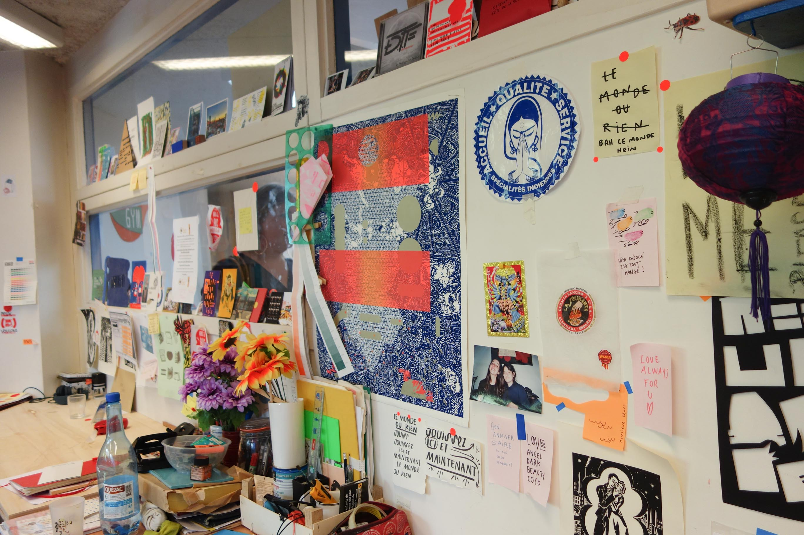
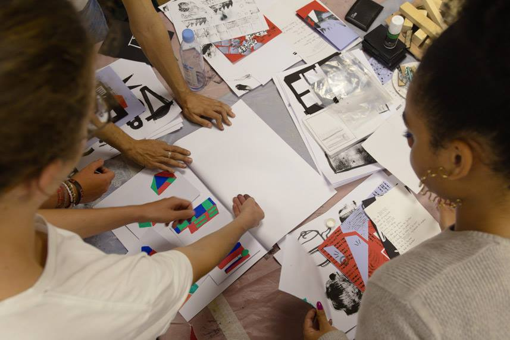
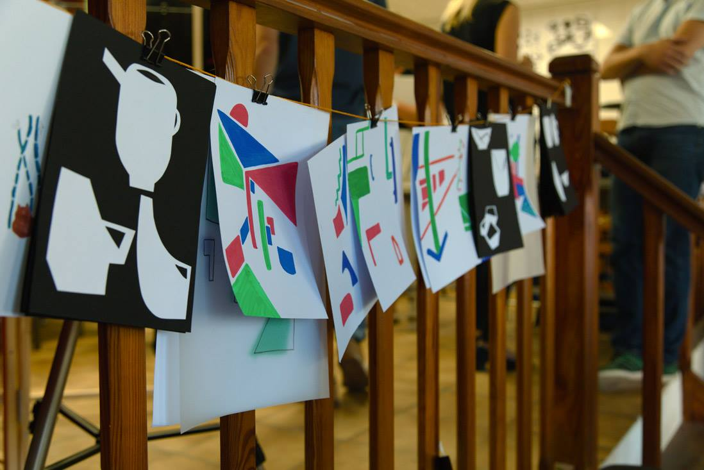
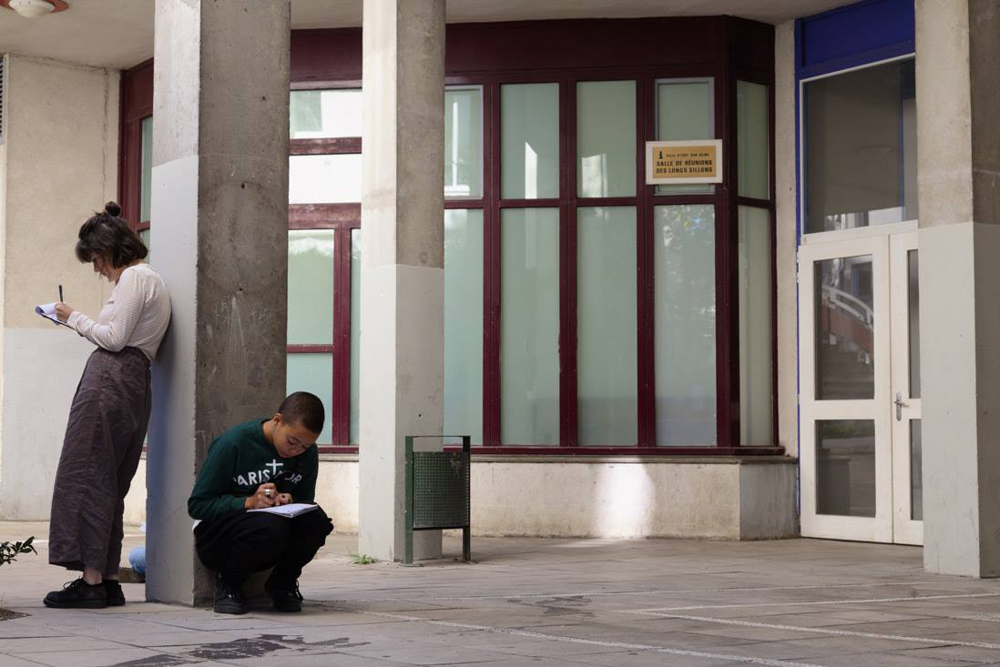
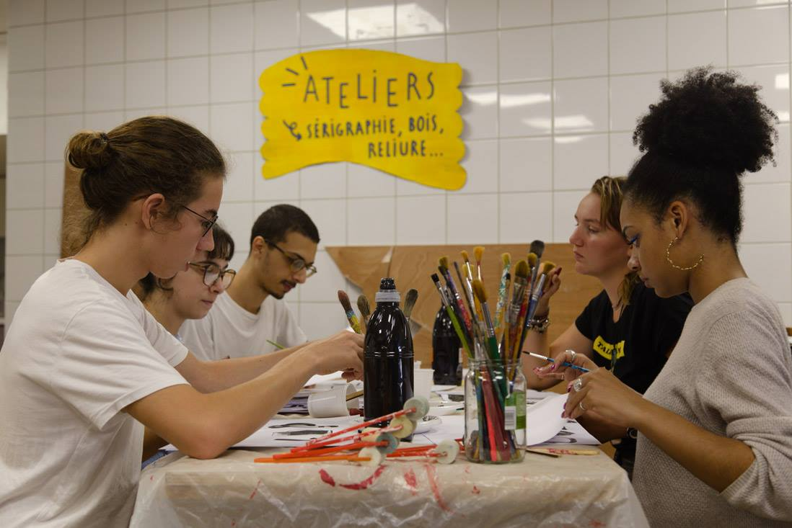

Le collectif NRP rassemble graphiste, plasticien, cinéaste, sérigraphe, illustrateur autour du rêve comme moteur de fabrication collective.

# La tracterie

## Workshop: Semaine 1

Premières recherches graphiques avec trois classes d'étudiants en céramique du lycée Renoir, pour la création d'un service à café et thé pour La Tracterie, notre café/atelier associatif.

